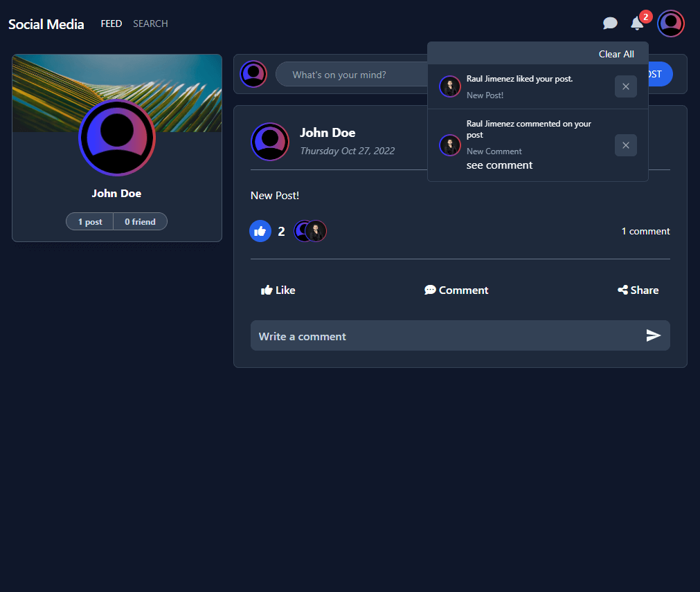

<p align="center">
    
</p>

<h3 align="center">ConnectME</h3>

## Description
ConnectME is a social media application that allows users to create an account, make posts, and interact with other users. It is built using the MERN stack (MongoDB, Express, React, Node.js) and is deployed on Heroku.

This project is a work in progress, and more features will be added in the future. The application use GraphQL subscriptions to allow users to receive real-time updates when other users interact with their posts (like, comment, etc.).

You can create an account or login with google account.

## Table of Contents
- [Description](#description)
- [Table of Contents](#table-of-contents)
- [Technologies and Tools](#technologies-and-tools)
- [Screenshots](#screenshots)
- [Installation](#installation)
- [Questions](#questions)

## Technologies and Tools
- [React](https://reactjs.org/)
- [Tailwind CSS](https://tailwindcss.com/)
- [Redux](https://redux.js.org/)
- [Node.js](https://nodejs.org/en/)
- [Express](https://expressjs.com/)
- [MongoDB](https://www.mongodb.com/)
- [GraphQL](https://graphql.org/)
- [oAuth2](https://oauth.net/2/)
- [Webpack](https://webpack.js.org/)
- [Heroku](https://www.heroku.com/)

## Screenshots
Feed

Profile 

Notifications

Mobile


## Installation
1. Clone the repository
   ```git clone git@github.com:jimenezraul/social-media.git```
2. Install dependencies
   ```npm install```
3. Rename the .env.example file to .env in the server directory and add your own values
4. Run the application
    ```npm run develop```


## Questions

Contact me by:    
Email: [jimenezraul1981@gmail.com](mailto:jimenezraul1981@gmail.com)   
LinkedIn: [LinkedIn](https://www.linkedin.com/in/raul-jimenez-778b2a196/)